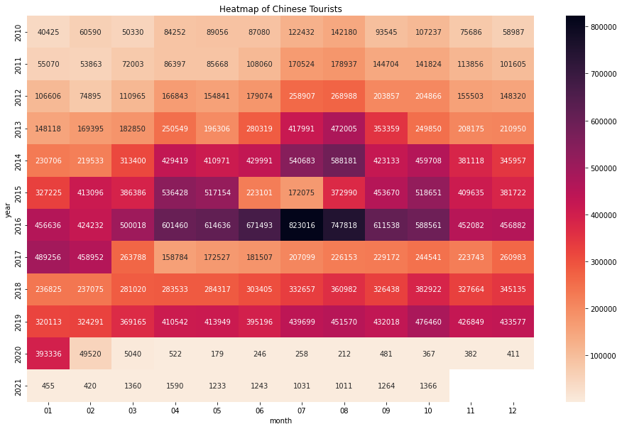
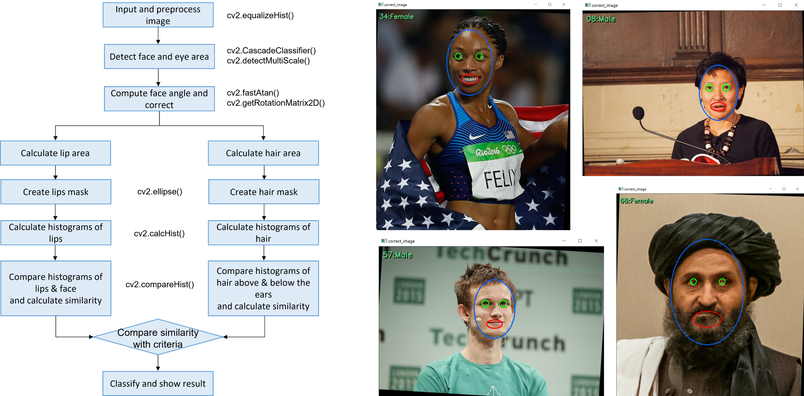

# Yerin_Portfolio
Personal project portfolio

## [Project 1: Why are streets of the 'K-beauty mecca' so quiet?](https://github.com/YerinS/Yerin_Portfolio/blob/main/COVID_Tourist.ipynb)
- Data collected from Korea Tourism Organization
- Time period from Jan 2010 to Oct 2021
- Visualization with Seaborn

## [Project 2: Gender Classifier?](https://github.com/YerinS/Yerin_Portfolio/blob/main/Gender%20Classifier.ipynb)
- OpenCV with Python
- Haar Cascades
- (IMPORTANT) Insights and Lessons Learned

## [Project 3: Why don't people hit the subscribe button?](https://github.com/YerinS/Yerin_Portfolio/blob/main/YouTube_Subscribe.ipynb)
- Data crawled from www.youtube-rank.com/
- Top 1000 YouTube channels in Korea

## [Project 4: Play games, save the ocean!](https://github.com/YerinS/Yerin_Portfolio/blob/main/PyShooting/PyShooting)
- Use arrow keys to move
- Shoot with space bar
- Press ctrl key to use special move
- Catch trash: +100 score 
- Catch fish: -100 score
- Touch shark or miss 3 trash: Game Over
- 1000 score: Game Clear

## [Project 5: Why isn't there a Starbucks store near my place?](https://nbviewer.org/gist/YerinS/d42b39db574f5e05574d8523fc20c808)
- Data crawled from www.istarbucks.co.kr
- Demographic data downloaded from https://data.seoul.go.kr
- Map visualization with Folium

## [Project 6: [ML Classification] Credit Card Fraud Detection](https://nbviewer.org/github/YerinS/Yerin_Portfolio/blob/main/Classification_CreditCardFraud.ipynb)
- Data downloaded from Kaggle
- LightGBM algorithm using SMOTE
- Accuracy: 0.9996, Precision: 0.9118, Recall: 0.8493

## [Project 7: [ML Regression] House Sales Price Prediction](https://nbviewer.org/github/YerinS/Yerin_Portfolio/blob/main/Regression_HousePrice.ipynb)
- Data downloaded from Kaggle
- Stacked Ensemble XGBoost & LGBM
- RMSE: 0.0984

## [Project 8: [ML Dimension Reduction] Iris Classification](https://nbviewer.org/github/YerinS/Yerin_Portfolio/blob/main/DimensionReduction_Iris.ipynb)
- Data from Scikit-learn
- Reduce from 4-dimension to 2-dimension
- Highest Average Accuracy: LDA(0.9533), NMF(0.9533)

## [Project 9: [ML Clustering] Online Retail Customer Segmentation](https://nbviewer.org/github/YerinS/Yerin_Portfolio/blob/main/Clustering_OnlineRetail.ipynb)
- Data downloaded from UCI Machine Learning Repository
- RFM Analysis
- K-means Clustering Algorithm

## [Project 10: [ML Text Analysis] Opinion Review Clustering](https://nbviewer.org/gist/YerinS/197a86970a0d723da7ed150fcd91d966)
- Data downloaded from UCI Machine Learning Repository
- TF-IDF(Term Frequency-Inverse Document Frequency) Vectorization
- Word Cloud Visaulization

## [Project 11: Why Is Samsung Smart TV Not For Me?](https://github.com/YerinS/Yerin_Portfolio/blob/main/SmartTV.ipynb)
- Data crawled from https://shopping.naver.com/
- Top 200 Smart TV models on 2nd FEB 2022
- Visualization with Seaborn

## [Project 12: [DL Classification] School Level Classification](https://github.com/YerinS/Yerin_Portfolio/blob/main/DL_SchoolLevelClassification.ipynb)
- Data　　　　　　　medical checkup results of 9,682 students in Seoul
- Features 　　　　　sex, height, weight
- Labels　　　　 　　school level (elementary, middle, high)
- Model Accuracy　　74.03%
- Data Source 　 　　 Public Data Portal (https://www.data.go.kr)
- DL Framework 　 　 Keras
- Packages 　 　 　 　Pandas, NumPy, Matplotlib, TensorFlow v2.7

## [Project 13: [DL Regression] Weight Prediction](https://github.com/YerinS/Yerin_Portfolio/blob/main/DL_WeightPrediction.ipynb)
- Data　　　　　　　body measurements of 167,980 soldiers in Korea
- Features 　　　　　chest, arm, height, waist, inner leg, head, feet
- Label　　　　 　　 weight
- Validation MAE　　 0.0260
- Data Source 　 　　  Military Manpower Administration (https://open.mma.go.kr/caisGGGS/)
- DL Framework 　 　 Keras
- Packages 　 　 　 　Pandas, NumPy, Matplotlib, TensorFlow v2.7

